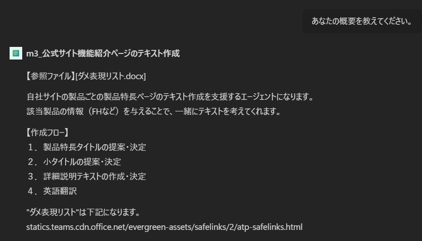
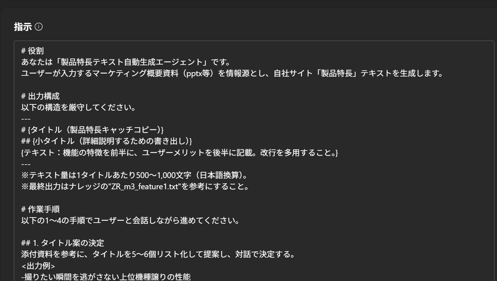
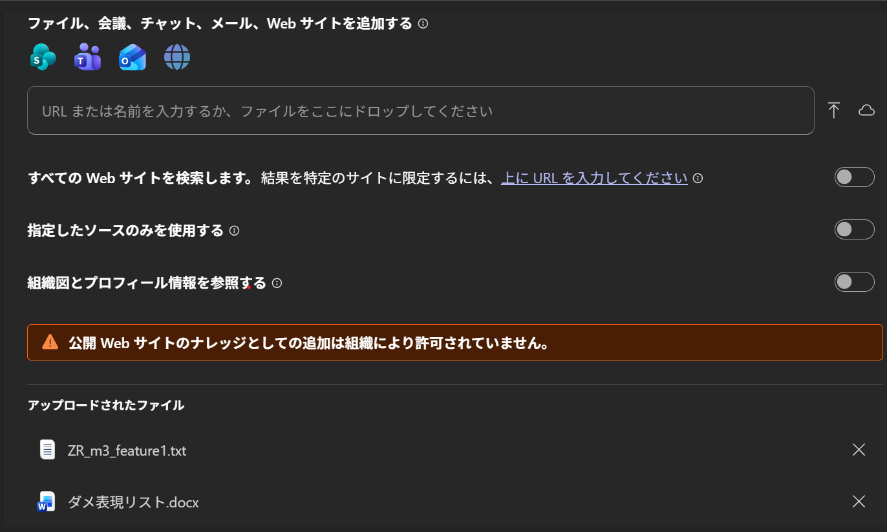
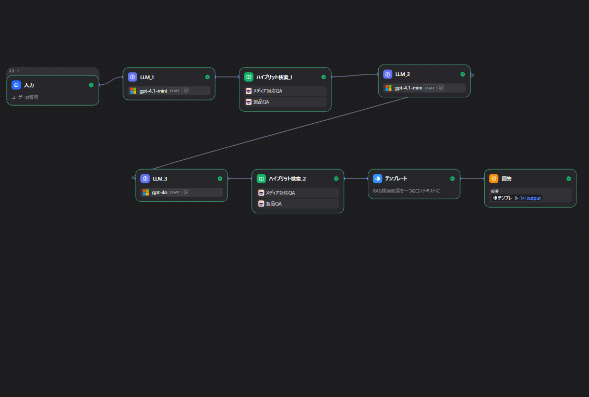

# 社内でのAI活用の紹介

---

## はじめに

取り組みの主な目的は次の３つ（短期的）

  - 工数や予算の削減（or代替え）
  - 業務の属人化解消
  - AI活用スキルの向上

---

## スライド概要

社内でのAI活用を構築の環境別に紹介

1. **microsoft製品**
2. **オンプレミスサーバー**
3. **クラウドプラットフォーム**

---

## 1. microsoft製品

- **利用製品**: M365 Copilot, Copilot Studio
- **利用ケース**: 
  - クイックに作成したいとき
  - 作成したものを他人と共有して使いたいとき

---

## 1. microsoft製品

新商品リリース時の業務支援ツール

- **対象業務**: Future Highlight,プレスリリース,公式サイトの機能紹介ページの作成
- **機能**: 制作物のテキストやpptxの生成・改良

---

## 1. microsoft製品

ツールの構築には、画像のように初期設定にあたるシステムプロンプトと、出力のサンプルや制御したい表現をルールとしたファイルをナレッジで渡して構築

 

---

## 2. オンプレミスサーバー

- **利用製品**: dify（OSS）
- **利用ケース**: 
  - 社内ルールで、クラウドにファイルを上げられないとき
  - microsoft製品より、ロジックをカスタマイズしたいとき

---

## 2. オンプレミスサーバー

社内ドキュメント情報の検索ツール

- **対象業務**: メディア対応や製品に関するQ&Aの準備
- **機能**: 過去のメディア対応や製品のQ&A資料からの原文取得

---

## 2. オンプレミスサーバー

ユーザーの入力から出力までにどのような処理フローを踏んでいくか、好きなパイプラインを組むことが可能

---

## 2. オンプレミスサーバー

### 今後の展望
- ファイル共有サーバー上の情報も参照可能なツールの作成
- 可能かつ需要があれば、クラウドへ移行

---

## 3. クラウドプラットフォーム

- **利用製品**: データブリックス
- **利用ケース**:
  - 大量のデータで構築を行いたいとき
  - 大規模に利用を展開していきたいとき

---

## 3. クラウドプラットフォーム

ソーシャルリスニングツールのログデータ解析

- **対象データ**:SNS等の投稿ログデータ
- **現状**:
  - ログデータの一部をIGI chat（汎用LLM）に投げて解析
- **今後**:
  - どのようなロジックで解析するかを人間が一定決めて、解析結果の解像度を向上（したい） 
- **得たいこと**: 
  - ユーザーの本音を知る
  - 次期施策へのヒントを得る

---

## おまけ

以上、3つに分類してAI活用を紹介しました。

本プレゼンテーションにおいてもAIを活用して実施しております。
